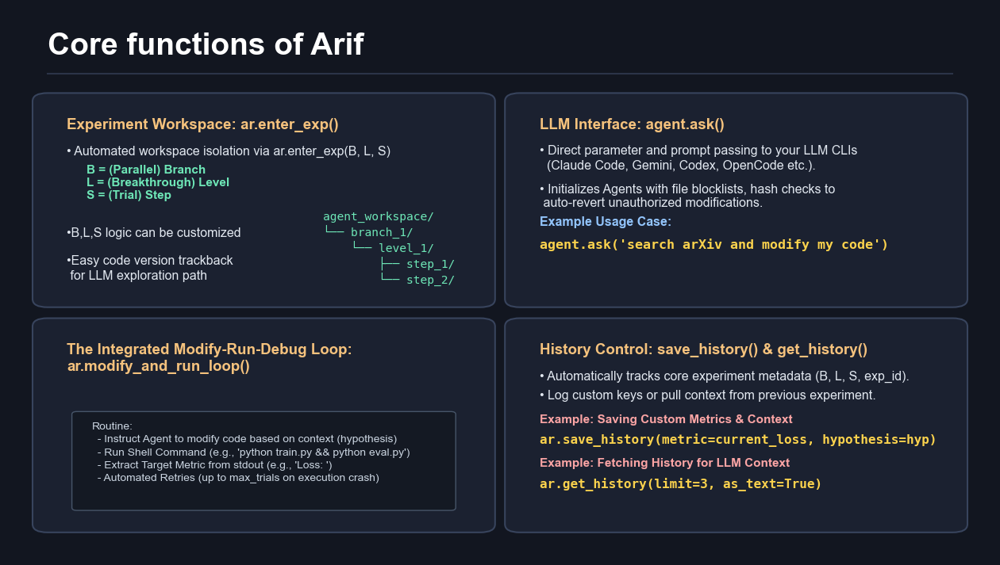

# Arif: Auto-Research In Few-lines

This micro-engine allows you to build your own auto-research agent in just a few lines of Python by orchestrating your coding CLIs (Claude Code, Codex, Gemini CLI, etc.) and shell commands. We have integrated the most essential and generic modules derived from my automated research experience. Our to-do list includes enabling your high-level agent to use `arif` to autonomously construct and monitor its own research workflows.

## Core Philosophy
An auto-research is essentially an evolution tree, where each node is an experiment. In Arif, an experiments is organized into a isolated folder expB.L.S (Branch, Level, Step) recording its code and outputs:
```text
agent_workspaces/
└── Branch1/
    ├── exp1.0.0/ (Baseline)
    ├── exp1.1.1/ (Failed attempt based on 1.0.0)
    ├── exp1.1.2/ (Success attempt based on 1.0.0)    
    └── exp1.2.1/ (Next attempt based on 1.1.2)
```

## Features
- **CLI Based**: Directly pass your prompt to your CLI, utilizing its intra-folder context management, tools and online search.
- **Inter-Folder History Management**: One line to save history.json with customized keys or load them at another experiment folder.
- **Intuitive loop**: An implementation example of the optimization cycle [`example/basic_loop.py`](example/basic_loop.py).



## Installation

```bash
git clone https://github.com/mx-Liu123/Auto-research-in-few-lines.git
cd Auto-research-in-few-lines
pip install -e .
```

---

## Diagnostic & Verification

Before starting your research, it is highly recommended to verify your local environment and CLI connectivity. This tool will check your logic and perform a "live-fire" modification test to ensure the **Guard** system is functioning correctly.

```bash
# Run all unit tests and live-fire tests for all installed CLIs
python3 tests/main_test.py --all

# Or run tests for specific CLIs only
python3 tests/main_test.py --all --cli gemini claude qwen codex
```

---

## Quick Start
Once installed, you can use **`arif_init.py`**, a bootstrap script that orchestrates Arif functions to automatically generate an evaluation judge and a research loop tailored to your specific task. To better understand the entire process from initialization to loop execution, we highly recommend checking out our interactive tutorial: **[Interactive Tutorial Notebook](example/tutorial/arif_tutorial.ipynb)**.

```bash
# 1. Copy the initialization script and agent guidelines to your project
cp example/cold_start_generate_evaluator_and_loop_file/{arif_init.py,README_for_agent.md} /your_project/
cd /your_project/
# 2. Run the initialization script (with full default parameters), noted that this operation might modify your project code so backup before initiating.
python arif_init.py \
  --task_background "This is a language model pretraining task on Climbmix-400B." \
  --your_idea_about_loop "Basically follows Standard Code Pattern in @README_for_agent.md" \
  --METRIC_prompt "evaluator.py metric use val_bpb" \
  --HOW_TO_RUN_YOUR_CODE "uv run train.py" \
  --DIAGNOSTIC_TIMEOUT 900 \
  --max_retry 5 \
  --cli_type "gemini"
```


Parameter Descriptions:
 * `--task_background`: Description of the task, telling the Agent what the optimization goal is.
 * `--your_idea_about_loop`: Expectations for the experiment loop (e.g., which template to reference).
 * `--METRIC_prompt`: Natural language description of the metric, used to guide the generation of the evaluator.
 * `--HOW_TO_RUN_YOUR_CODE`: The command to run your original training code.
 * `--DIAGNOSTIC_TIMEOUT`: Maximum wait time (in seconds) for the diagnostic run. Recommended: training time + compilation overhead.
 * `--max_retry`: Maximum number of retries when automatically generating the evaluator and loop scripts.
 * `--cli_type`: The model engine type to use (default is `gemini`). Supported engines include: `claude`, `codex`, `gemini`, `qwen`.

 After the script finishes, it will generate the following components:
 * **`evaluator.py`**: An independent, anti-cheating judge that extracts metrics from your project's output artifacts (model weights etc).
 * **`arif_loop.py`**: The main autonomous loop that orchestrates experiment branches and coordinates the "Modify -> Run -> Evaluate" cycle.
 * **`arif_init_output.log`**: A detailed log containing the full trace of LLM prompts and agent responses. **Check this if the initialization process fails or behaves unexpectedly.**

 You can then start the automated research process by running `python arif_loop.py`.

 ## Core Components

 ### AIAgent
 A wrapper for LLM CLI tools with persistent context and retry logic.
 - `__init__(engine: str, model: str | None, delay: int, system_prompt: str, default_guard: any, default_timeout: int | None, log_path: str | None)`: Set global defaults.
 - `ask(prompt, guard, timeout, new_session, model, ...)`: Executes an LLM call with optional local overrides. Automatically handles rate limits and session persistence.
 - Supported adapters: Gemini, Qwen, Claude, and Codex CLI.

 ### AutoResearch
 Handles the experiment lifecycle, workspace isolation, and history management.
 - `__init__(project_root: str, protected_files: list[str] | None, log_path: str | None)`: Initialize workspace root (`agent_workspaces/`). Supports cross-platform path handling.
 - `modify_and_run_loop(agent, modify_prompt, eval_cmd, metric_extract, ..., smaller_is_better=True)`: High-level abstraction for the iterative "Modify -> Run -> Evaluate" cycle with automatic feedback-based retries.
 - `get_history(B, L, S, if_improved, limit, as_text=True)`: Retrieves past experiment data, supporting range filtering and text formatting for LLM context.
 - `enter_exp(B, L, S)`: Context manager that creates and enters an isolated snapshot folder for a specific experiment trial.
 - `save_history(metric, if_improved, ...)`: Persists trial results and summaries to `history.json` within the experiment folder.

 ### Guard
 An anti-cheating and integrity monitor that prevents unauthorized modifications to critical files.
 - Uses MD5 hashing to snapshot protected files (including directories) before LLM operations.
 - Automatically detects changes and restores files from the `project_root` if tampering is detected.


### Diabetes Model Optimization
A complete example that optimizes a scikit-learn model using the diabetes dataset.
```bash
cd example/diabetes_sklearn
python arif_run.py
```

## License
MIT

## Acknowledgments

Special thanks to:
* **Prof. Alvin J. K. Chua**
* **Prof. Duane LOH** (Ne-Te) and his [AI for Science Discovery Gym](https://duaneloh.notion.site/AI-for-Science-Discovery-Gym-24127332a77880b2a51cd242a1ee0c2c)
* **Mr. Zhu** for providing computation resources

This project was inspired by:
* [autoresearch](https://github.com/karpathy/autoresearch) by Andrej Karpathy
* [Auto-claude-code-research-in-sleep (ARIS ⚔️🌙)](https://github.com/wanshuiyin/Auto-claude-code-research-in-sleep)
* [AgentCommander](https://github.com/mx-Liu123/AgentCommander)
